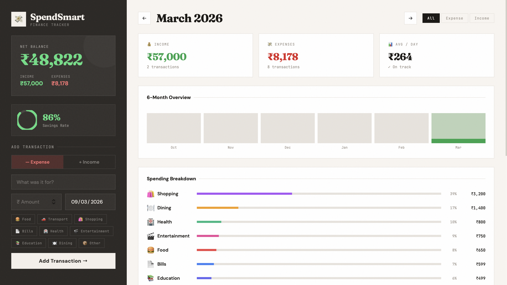

# 💸 SpendSmart — Personal Finance Tracker

A full-featured personal expense and income tracker with monthly analytics, category breakdowns, a 6-month spending chart, and savings rate tracking — all stored locally in your browser.

## 🚀 Live Demo

[View Live →](https://expense-tracker-six-self-77.vercel.app)

## 📸 Preview



## ✨ Features

- ➕ **Add income & expenses** with categories, amounts, and dates
- 💰 **Net balance** calculated in real time
- 📊 **Animated savings rate ring** showing your savings percentage
- 📅 **Month navigation** — browse and compare any past month
- 📈 **6-month bar chart** — visual spending history
- 🗂 **Category breakdown** with animated progress bars
- 🔍 **Live search** — filter transactions as you type
- 🏷 **Filter by type** — All / Income / Expense
- 🗑 **Delete transactions** with one click
- 💾 **Persistent storage** — data saved in localStorage
- 🔔 **Toast notifications** for every action
- 📱 **Fully responsive** for mobile and desktop

## 🛠 Tech Stack

| Technology | Purpose |
|---|---|
| HTML5 | Structure |
| CSS3 | Styling & Animations |
| JavaScript (ES6+) | Logic & State Management |
| localStorage API | Data Persistence |

## 📁 Project Structure

```
expense-tracker/
├── index.html          # Main HTML entry point
├── css/
│   └── style.css       # All styles and animations
├── js/
│   ├── config.js       # Categories & sample data
│   ├── store.js        # Data layer (localStorage CRUD)
│   ├── ui.js           # UI rendering module
│   └── app.js          # Main app controller
└── assets/
    └── preview.png     # App screenshot
```

## ⚙️ Setup & Run Locally

```bash
# 1. Clone the repository
git clone https://github.com/shanmukjavvadi/expense-tracker.git

# 2. Open the project
cd expense-tracker

# 3. Open in browser
open index.html
# OR use Live Server in VS Code
```

> No installation or dependencies required. Pure HTML, CSS, and JavaScript.

## 🏗 Architecture

The app follows the **Separation of Concerns** principle:

| Module | Responsibility |
|---|---|
| `config.js` | Static data — categories, sample transactions |
| `store.js` | All data operations — CRUD, localStorage |
| `ui.js` | Pure rendering functions — no business logic |
| `app.js` | Event handling, state, orchestration |

## 📊 Expense Categories

| Category | Emoji |
|---|---|
| Food | 🍔 |
| Transport | 🚗 |
| Shopping | 🛍️ |
| Bills | 📄 |
| Health | 🏥 |
| Entertainment | 🎬 |
| Education | 📚 |
| Dining | 🍽️ |
| Other | 📦 |

## 📱 Responsive Design

| Device | Support |
|---|---|
| Desktop | ✅ Sidebar + main layout |
| Tablet | ✅ Stacked layout |
| Mobile | ✅ Compact cards |

## 🔮 Future Improvements

- [ ] Export transactions to CSV
- [ ] Set monthly budget limits with alerts
- [ ] Recurring transactions support
- [ ] Charts using Chart.js
- [ ] Multi-currency support
- [ ] Cloud sync (Firebase/MongoDB)

## 👨‍💻 Author

**Javvadi Shanmuk Sai Vardhan**
- GitHub: [@shanmukjavvadi](https://github.com/shanmukjavvadi)
- LinkedIn: [shanmuk-javvadi](https://linkedin.com/in/shanmuk-javvadi)
- Email: shanmukjavvadi@gmail.com

## 📄 License

This project is open source and available under the [MIT License](LICENSE).
